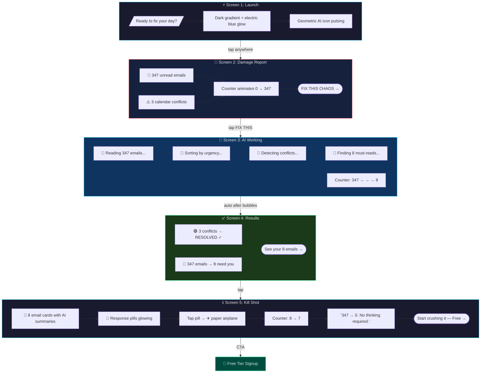

# Version B: The Chaos Killer ⚡ — User Flow

## Dopamine Arc

```mermaid
graph LR
    A["😤 Frustrated"] -->|"Screen 1"| B["💪 Ready to fight"]
    B -->|"Screen 2"| C["😳 Seeing the damage"]
    C -->|"Screen 3"| D["😈 Watching AI destroy chaos"]
    D -->|"Screen 4"| E["🎯 347 → 8. Satisfaction."]
    E -->|"Screen 5"| F["🤯 One tap sends. 8 → 7 → 0"]
    F --> G["💳 Shut up and take my money"]

    style A fill:#FFCDD2,stroke:#E53935
    style B fill:#FFE0B2,stroke:#FB8C00
    style C fill:#FFF9C4,stroke:#FDD835
    style D fill:#E1BEE7,stroke:#8E24AA
    style E fill:#C8E6C9,stroke:#43A047
    style F fill:#BBDEFB,stroke:#1E88E5
    style G fill:#A5D6A7,stroke:#2E7D32
```

## Design Tokens
| Element | Value |
|---------|-------|
| Background | `#1A1A2E` (near black) |
| Primary accent | `#00D4FF` (electric blue) |
| Success | `#00FF88` (electric green) |
| Danger | `#FF4444` (alert red) |
| Text | `#E0E0E0` (light grey) |
| Font | Inter / SF Pro (system, bold weights) |
| Animation | Snappy, satisfying pops, numbers counting down |
| Micro-copy tone | Direct, confident, zero BS |
