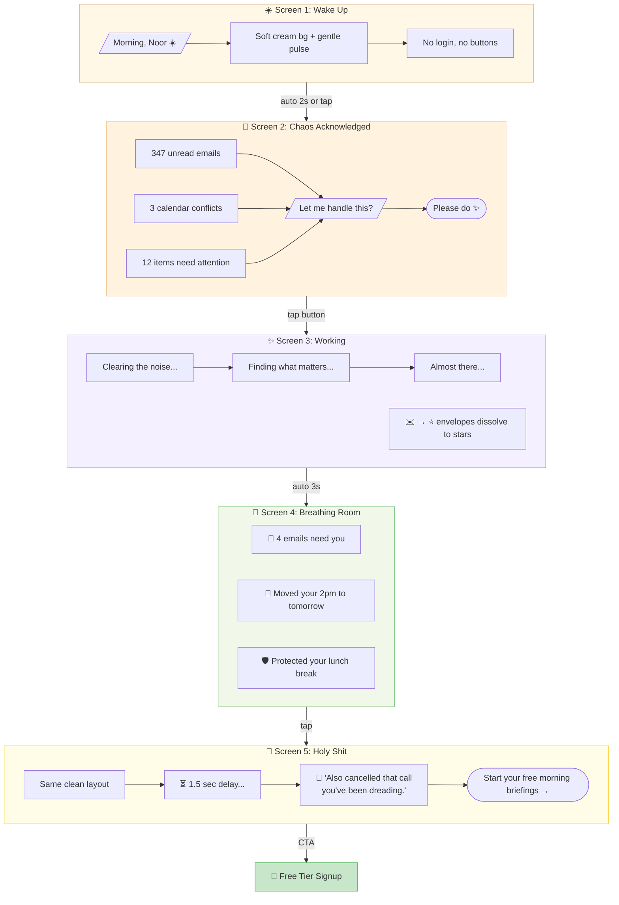

# Version A: The Warm Human 🌅 — User Flow

## Emotional Arc

```mermaid
graph LR
    A["😰 Overwhelmed"] -->|"Screen 1"| B["😌 Acknowledged"]
    B -->|"Screen 2"| C["🤞 Hopeful"]
    C -->|"Screen 3"| D["😊 Watching magic"]
    D -->|"Screen 4"| E["😮‍💨 Relief"]
    E -->|"Screen 5"| F["🤯 Holy shit"]
    F --> G["💳 Take my money"]

    style A fill:#FFCDD2,stroke:#E53935
    style B fill:#FFE0B2,stroke:#FB8C00
    style C fill:#FFF9C4,stroke:#FDD835
    style D fill:#E1BEE7,stroke:#8E24AA
    style E fill:#C8E6C9,stroke:#43A047
    style F fill:#BBDEFB,stroke:#1E88E5
    style G fill:#A5D6A7,stroke:#2E7D32
```

## Design Tokens
| Element | Value |
|---------|-------|
| Background | `#FFF8F0` (warm cream) |
| Accent | `#D4A574` (amber) |
| Text | `#2C1810` (warm dark) |
| Heading Font | Crimson Text (serif) |
| Body Font | Source Sans Pro |
| Animation | Breathe (slow pulse), never rushed |
| Micro-copy tone | Warm friend who happens to be organized |
